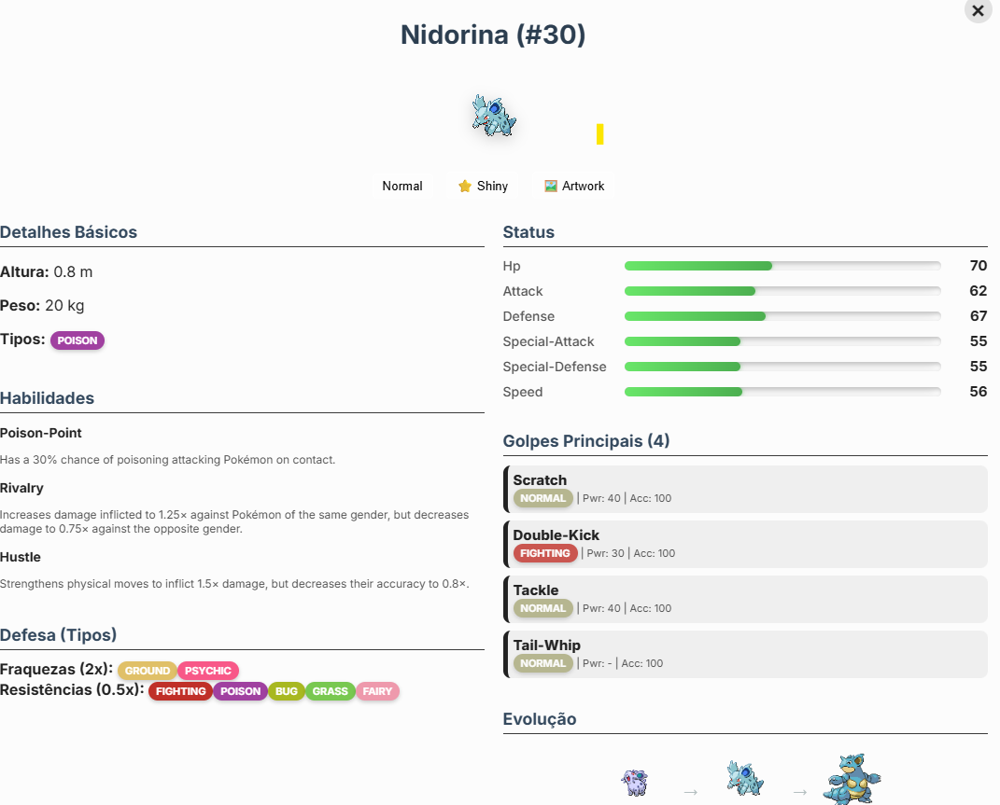

# Pokedex Mercos

Este é o projeto da Pokédex desenvolvido para o desafio Mercos.

Como rodar o projeto
Você pode executar o projeto sem instalar nada:

1. Baixe o repositório 
2. Extraia o ZIP
3. Abra o arquivo **index.html** no navegador (Chrome, Edge ou Firefox)

Isso já inicia a Pokédex.

---

 Níveis completados

 Nível 1 – Estrutura básica da Pokédex
 Nível 2 – Listagem inicial de pokémons
 Nível 3 – Detalhes simples de cada pokémon
 Nível 4 – Filtros avançados
 Nível 5 – Animações e polimentos finais

---

Dificuldades encontradas

- Trabalhar com o consumo de API e manipulação dos dados JSON
- Ajustar CSS responsivo para celulares e telas menores.
- Gerenciar estados da interface usando JavaScript puro.
- Adaptação inicial ao fluxo do GitHub.
- Além do perfeccionismo onde precisei ir buscando formas de melhorar e dar um upgrade cada vez maior ao projeto e que talvez tenha me confundido cada vez mais em alguns momentos fazendo com que eu recomeçasse o projeto do zero 

---

 Prints da aplicação inclusos 

